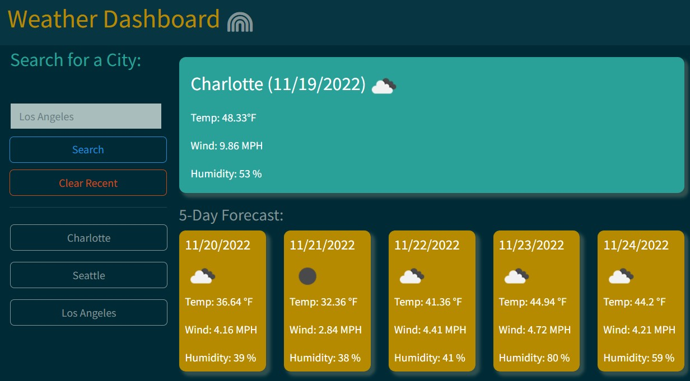

# Weather-Dashboard

## Description
The Weather Dashboard application will be your best searching option to find the current and five day forcast for whatever city you search for using this application. This cleaver application will also keep your search histoy for easy one click search of the latest searches made.

## Purpose
The Weather Dashboard application has a clear and easy-to-use interface that allows users to easily search for their desired city and see the current weather and five day foracst.

## Installation
To install my project use the following link: https://github.com/dianavw8/Weather-Dashboard and follow these simple directions:

Above the list of files, click on the "Code" button.

Copy the URL for the repository.

Open Git Bash.

Change the current working directory to the location where you want the cloned directory.

Type git clone, and then paste the URL you copied earlier.

Press Enter to create your local clone.

For more help and information achiving this, check out the following website: https://docs.github.com/en/repositories/creating-and-managing-repositories/cloning-a-repository

## Usage
The refactored website can be found at: https://dianavw8.github.io/Weather-Dashboard/

The following image demonstrates the web application's appearance and functionality:

## Lessons Learned
The Weather Dashboard application gave me a chance to learn and use API's. This was challanging at first, but by the end of the project I felt more comfortable using an API for future projects.

## Credits and Inspiration
https://github.com/dianavw8

https://coding-boot-camp.github.io/full-stack/github/professional-readme-guide

https://docs.github.com/en/repositories/creating-and-managing-repositories/cloning-a-repository

https://bootswatch.com/solar/